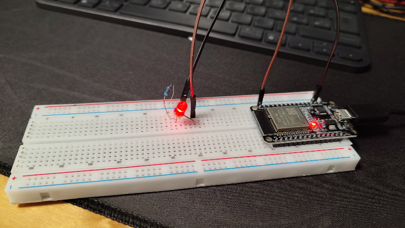
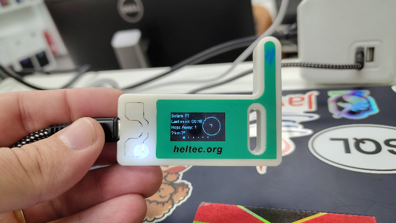

# Microcontrollers - Hands-on workshop 🙌🎮🛜🏠🤖


In this session we will explore 🕵‍♂ the amazing world of the modern microcontrollers. In the last 20 years there has been huge leap in what can be done with small and cheap chips.  [Arduino](https://projecthub.arduino.cc/) started this and it continues to be one of thae major platforms but many followed its trail and expanded the way microcontrollers can be used nowadays. The most notable platform is the [ESP32](https://www.espressif.com/en/products/socs/esp32) family of microcontrollers, offering integrated Wi-Fi and BT  connectivity 🛜 .

We will start with a brief introduction to microcontrollers 🧑‍🏫, why they are so cool and what can be done with them. As examples we will use:
- 5x [Adafruit Pybadge](https://learn.adafruit.com/adafruit-pybadge/overview) gaming 🎮 handhelds
- An ESP32 starter-kit with plenty of sensors and other components
- 2x ESP32 LoRa Development boards for [Meshtastic](https://meshtastic.org/) connectivity (if the Gods of AliExpress allow it 🙏)

After the presentation, we will form groups to play 🛝 with all the toys 🧸 we will bring to the workshop 🧑‍🏭. We will prepare some ideas 💡 beforehand but, we highly encourage you to bring your own! 💭

Don't forget to bring your laptop 💻 and if you have your own microcontroller related stuff bring it as well. It would be awesome to share our experiences and experiments 🔬 .

## Location

This event will take place at Flywire's offices in Valencia.

Don’t miss it!

## Presentation

Slides [published](https://llyorshch.github.io/microcontrollers-hands-on-workshop) in GitHub Pages.

## Examples

### esp32-blink-example



The "hello world" of ESP32 is the blink example. We could have used a reasonable easy way of starting with ESP32 by following a nice Arduino IDE tutorial like [this one](https://zhillan-arf.medium.com/blink-the-led-with-esp32-5c3f358ea2ff). That tutorial describes very well the way to assemble everything in the breadboard. We could have done it easy-peasy but we like **the hard way** 👷, i.e. using [the ESP-IDF official programming guide](https://docs.espressif.com/projects/esp-idf/en/latest/esp32/index.html). We can go directly to [the Standard Toolchain Setup](https://docs.espressif.com/projects/esp-idf/en/latest/esp32/get-started/linux-macos-setup.html). Another option is to use a distribution package like [this one for Arch Linux](https://aur.archlinux.org/packages/esp-idf). In any case, the objective is to be able to run the `idf.py` command. Almost everything is done with that python command. It is important to set properly the environment and ideally to setup an alias to activate the IDF virtual environment.

As a bonus, we can install and use [the ESP-IDF VSCode Extension](https://github.com/espressif/vscode-esp-idf-extension). The installation guide goes in detail on [how to setup the extension properly](https://github.com/espressif/vscode-esp-idf-extension?tab=readme-ov-file#install). Once the extension is installed, the documentation also details [how to use it](https://github.com/espressif/vscode-esp-idf-extension?tab=readme-ov-file#using-the-esp-idf-extension-for-vs-code). 


The example is not uploaded to the git repository because it is just [the `blink` example](https://github.com/espressif/vscode-esp-idf-extension/blob/master/README.md#using-the-esp-idf-extension-for-vs-code) from the ESP-IDF documentation. Just follow the steps described (selecting `Blink` which is the first one) to make it work.

Don't forget to:

- Select the right resistance
- Plug the pins correctly
- Select the signal pin you used in the menuconfig. The one in the photo is `D23`
- The long leg of the led goes to the signal pin. The short leg goes to the `GND` pin. 
- ⚡ **Don't forget to connect the ground (`GND`) cable** ⚡

## Meshtastic



This example uses two ESP32 Lora V3 OLED development boards [from Aliexpress](https://es.aliexpress.com/item/1005007765354372.html). Each board is paired with a cellphone with Bluetooth and the [Meshtastic](https://meshtastic.org/) application for Android.

One of the boards is connected to the PC with an USB cable because we want to capture the activity from the device on every message it receives. The file [incoming_reader.py](incoming_reader.py) contains the code to connect to the device and monitor the messages. 

The example uses [Meshtastic Python library](https://pypi.org/project/meshtastic/). It is recommended to [create a Python virtual environment](https://docs.python.org/3/library/venv.html#how-venvs-work) to install the meshtastic library and to execute the code. The example is almost the same from [the Meshtastic development guide](https://meshtastic.org/docs/development/python/library/). 

Just make sure both devices are powered on and connected to the cellphones. Run the python file of the example and wait until the stout displays:

```
Connected to node: XXXXX
```

XXXXX is the name of the device A. 

Then send a message from the cellphone connected to the device B (the other one). For instance, if you send "Hello! 👋" You will see something like this in the stdout:

```
Received: Hello! 👋
```

You can finish the executing by pressing Enter in the terminal where you executed the python file.

<!-- ## Workshop BOM -->


